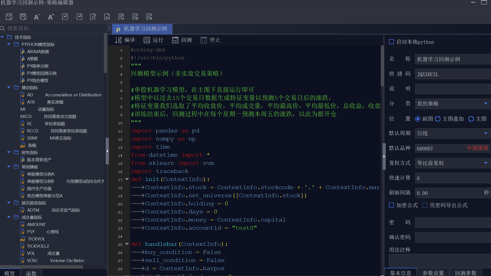
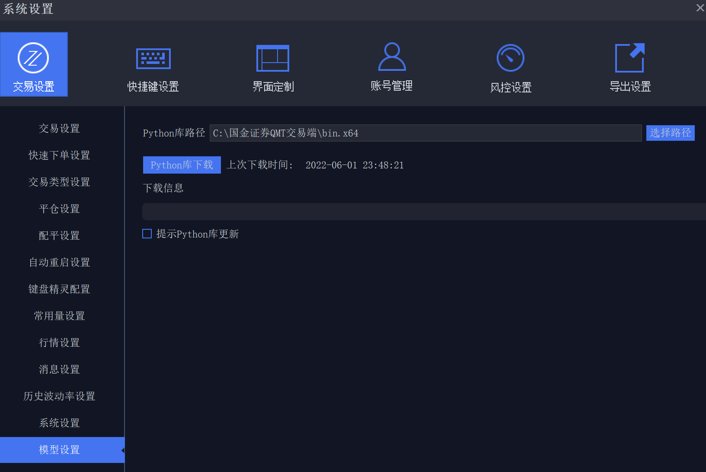
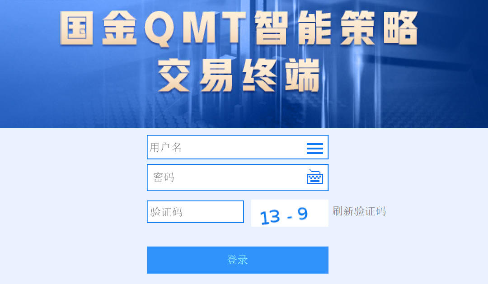
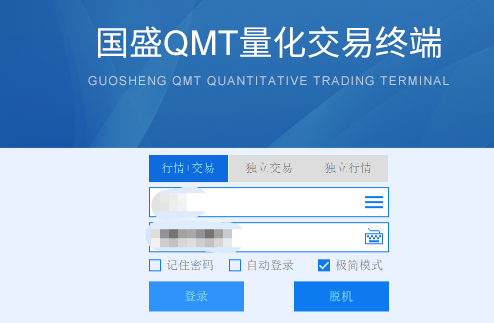
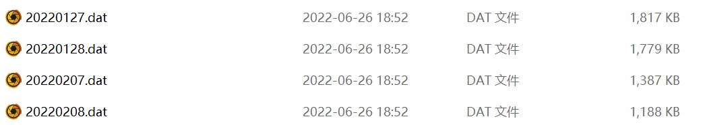
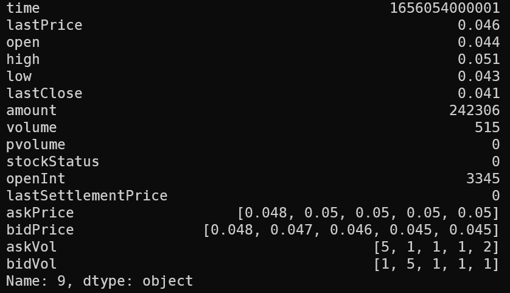
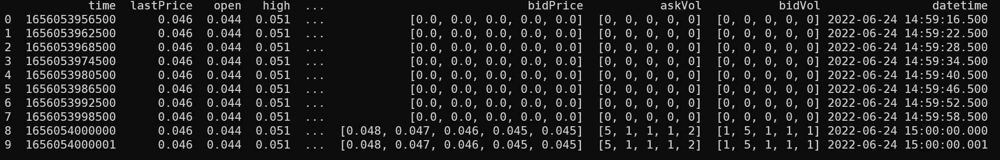
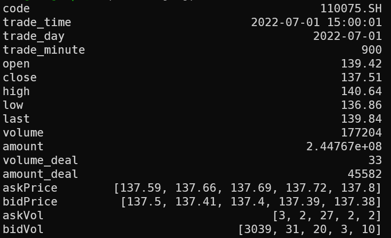
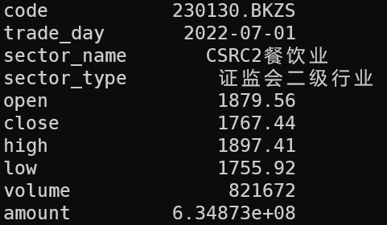
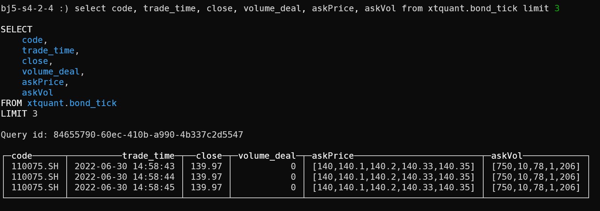

# XtQuant
迅投QMT接口相关介绍和常用功能封装

## 目录

- [XtQuant](#xtquant)
  - [目录](#目录)
  - [xtquant介绍](#xtquant介绍)
  - [行情接口分析](#行情接口分析)
    - [行情接口概况](#行情接口概况)
    - [实战：历史行情数据下载](#实战历史行情数据下载)
    - [实战：历史行情批量缓存](#实战历史行情批量缓存)
    - [实战：历史行情转存数据库](#实战历史行情转存数据库)
    - [实战：实时行情订阅](#实战实时行情订阅)
  - [未完待续......](#未完待续)

----

## xtquant介绍

**迅投QMT极速策略交易系统** 是一款专门针对券商、期货公司、信托等机构的高净值客户开发设计的集行情显示，投资研究，产品交易于一身，并自备完整风控系统的综合性平台。其自带投研量化平台可以灵活实现CTA，无风险套利等多种量化策略，并能够对策略进行回测检验和自动化交易。目前大部分券商都有支持策略交易，目前已知的像国金、国盛、国信、海通、华鑫等券商均有对普通用户开放，在开通资金门槛、功能阉割和佣金费率方面可能有一些差异，目前部分券商股票佣金可低至万1，可极大降低量化交易摩擦成本。



`xtquant`是`QMT`官方内置的`XtMiniQmt`极简客户端对应的Python接口，目前支持的版本为3.6~3.8，可支持历史行情下载、实时数据订阅、外部数据访问、普通账户和两融账户交易(需开通相关权限)，对量化交易支持的比较完善，跟极速策略交易系统相比最主要的优势是简洁、灵活，不局限在bar、kline的事件触发，可以容易地集成多种数据源进行综合分析。相关文档可在仓库[文档](xtquant/doc)中详细阅读。

`QMT`内置的Python版本为3.6，第一次使用的话需手动下载相关的库，或直接拷贝已经下载好的`xtquant`库。





`XtMiniQmt.exe`存在于QMT安装目录下的`bin.x64`子目录中, `xtquant`库默认安装在`bin.x64\Lib\site-packages`中。

内置的Python版本较老，对于一些较新的库支持有限，因此，如果我们想在自定义的`Python`中调用，如`Python3.8`，只需将`xtquant`拷贝到我们自己python安装目录的`Lib\site-packages`中便可，这里我的安装路径是 C:\ProgramData\Anaconda3\Lib\site-packages\xtquant。

`xtquant`主要包含两大块：
- **xtdata**：`xtdata`提供和`MiniQmt`的交互接口，本质是和`MiniQmt`建立连接，由`MiniQmt`处理行情数据请求，再把结果回传返回到`python`层。需要注意的是这个模块的使用目前并不需要登录，因此只要安装了`QMT`,就可以无门槛的使用其提供的数据服务。
- **xttrader**：`xttrader`是基于迅投`MiniQMT`衍生出来的一套完善的Python策略运行框架，对外以Python库的形式提供策略交易所需要的交易相关的API接口。该接口需开通A股实盘版权限方可使用。

在运行使用`XtQuant`的程序前需要先启动`MiniQMT`客户端。通常有两种方式，一种是直接启动极简QMT客户端`XtMiniQmt.exe`



如果登录时提示没有相关权限，可尝试启动QMT量化交易终端`XtItClient.exe`,在登录界面选择极简模式




## 行情接口分析

QMT行情有两套不同的处理逻辑：
- 数据查询接口：使用时需要先确保MiniQmt已有所需要的数据，如果不足可以通过补充数据接口补充，再调用数据获取接口获取。适用于少量的实时行情数据和大批量的历史行情数据。
- 订阅接口：直接设置数据回调，数据到来时会由回调返回。订阅接收到的数据一般会保存下来，同种数据不需要再单独补充。适用于大批量的实时行情数据。

按照类别，主要有以下四类：
- 行情数据（K线数据、分笔数据，订阅和主动获取的接口）
- 财务数据
- 合约基础信息
- 基础行情数据板块分类信息等基础信息

### 行情接口概况

首先导入行情库：
``` python
from xtquant import xtdata
print(dir(xtdata))
```
可以看到行情主要分为以下几个模块：
- 实时行情订阅：subscribe* 系列
- 基本信息和行情查询：get_* 系列
- 历史数据订阅： download_* 系列 
- 历史数据处理： get_local_data

针对数据存储目录，默认为`xtdata.data_dir=../userdata_mini/datadir`, 按照官方文档的说明似乎可以任意设置，但实操下来却发现没起到作用。因此，如果默认存储空间有限的话，我们可以将其移动到有较大空间的地方，然后创建一个快捷方式指向原来的地方，避免磁盘空间被耗尽。

### 实战：历史行情数据下载

QMT提供的历史行情下载接口有两个：
- 单支股票下载：download_history_data(stock_code, period, start_time='', end_time='')
- 批量股票下载：download_history_data2(stock_list, period, start_time='', end_time='',callback=None)

其中各个参数具体含义如下：
- stock_code：股票名，以`code.exchange`的形式表示，exchange可从如下品种中选择
    - 上海证券(SH), 如`510050.SH`
    - 深圳证券(SZ), 如`159919.SZ`
    - 上海期权(SHO), 如`10004268.SHO`
    - 深圳期权(SZO), 如`90000967.SZO`
    - 中国金融期货(CFFEX), 如`IC07.CFFEX`
    - 郑州商品期货(CZCE), 如`SR05.CZCE`
    - 大连商品期货(DCE), 如`m2212.DCE`
    - 上海期货(SHFE), 如`wr2209.SHFE`
    - 能源中心(INE), 如`sc00.INE`
    - 香港联交所(HK), 如`00700.HK`
- stock_list, 股票列表，如['510050.SH', '159919.SZ']
- period, 数据周期，可选`1m`、`5m`、`1d`、`tick`, 分别表示1分钟K线、5分钟K线、1天K线、分笔数据
- start_time, 数据起始时间，格式YYYYMMDD/YYYYMMDDhhmmss/YYYYMMDDhhmmss.milli，如 "20200427" "20200427093000" "20200427093000.000"
- end_time，数据结束时间，格式同start_time

如果运行如下代码，下载深圳市场300ETF期权`沪深300ETF购9月4900`标的的tick行情，就会在`userdata_mini\datadir\SZO\0\90000967`目录下生成以日为单位的tick数据：

``` python
import pandas as pd
from xtquant import xtdata

xtdata.download_history_data('90000967.SZO', period='tick')
data = xtdata.get_local_data(field_list=[], stock_code=['90000967.SZO'], period='tick', count=10)

df = pd.DataFrame(data['90000967.SZO'])
print(df.iloc[-1])

```



上述二进制文件是无法直接读取的，这里通过`get_local_data`接口进行数据文件的解析，便可解码已经下载的上述tick行情，包含Unix时间戳、K线、买五卖五快照信息等：



注意到这里的Unix时间戳是精确到毫秒的，可以通过datetime转换成字符型：
``` Python
import datetime
df['datetime'] = df['time'].apply(lambda x: datetime.datetime.fromtimestamp(x / 1000.0))
print(df)
```



### 实战：历史行情批量缓存

1、获取股票名称列表

QMT的行情函数暂时不能获取可转债列表，因此这里使用`akshare`库进行相关元数据的获取，使用前确保已安装。`akshare`库本身的功能十分强大，后续将详细展开，这里先不赘述。

首先导入相关的包：
```python
from xtquant import xtdata
import akshare as ak
from tqdm import tqdm
import pandas as pd
```

第一个接口是获取包含历史转债代码的列表，以方便同步历史数据，可转债上海市场以11开头，深圳市场以12开头，这里需要将akshare中来自东方财富的数据与QMT进行代码的对齐：
```python
def get_bond_history():
    bond_zh_cov_df = ak.bond_zh_cov()
    # 排除至今未上市的转债
    bond_zh_cov_df =  bond_zh_cov_df[bond_zh_cov_df['上市时间'] <= datetime.date.today()]
    stock_code_list, bond_code_list = [], []
    for _, row in bond_zh_cov_df.iterrows():
        if row['债券代码'].startswith('11'):
            market = '.SH'
        else:
            market = '.SZ'
        stock_code_list.append(row['正股代码'] + market)
        bond_code_list.append(row['债券代码'] + market)
    return stock_code_list, bond_code_list
```

第二个接口是获取实时转债代码的列表，以方便增量更新，避免重复下载：
```python
def get_bond_spot():
    bond_cov_comparison_df = ak.bond_cov_comparison()
    # 排除至今未上市的转债
    bond_cov_comparison_df =  bond_cov_comparison_df[bond_cov_comparison_df['上市日期'] !='-']

    stock_code_list, bond_code_list = [], []
    for _, row in bond_cov_comparison_df.iterrows():
        if row['转债代码'].startswith('11'):
            market = '.SH'
        else:
            market = '.SZ'
        stock_code_list.append(row['正股代码'] + market)
        bond_code_list.append(row['转债代码'] + market)
    return stock_code_list, bond_code_list
```

第三个接口是获取A股市场的沪深指数、所有A股、ETF、债券列表等股票代码，以便下载K线数据：
```python
def get_shse_a_list():
    '''
    获取沪深指数、所有A股、ETF、债券列表
    '''
    index_code = ['000001.SH', '399001.SZ', '399006.SZ', '000688.SH', '000300.SH', '000016.SH', '000905.SH', '000852.SH'] # 上证指数、深证成指、创业板指、科创50、沪深300、上证50、中证500、中证1000
    a_code = xtdata.get_stock_list_in_sector('沪深A股')
    etf_code =  xtdata.get_stock_list_in_sector('沪深ETF')
    #bond_code = [i for i in xtdata.get_stock_list_in_sector('沪深债券') if i[:3] in {'110',  '111', '113', '118', '123', '127', '128'}]
    bond_code = get_bond_history()[-1]

    return index_code + a_code + etf_code + bond_code
```

2、批量下载可转债tick数据

通过控制参数`init`来决定是否增量下载(以天为粒度)：
```python
def download_history_bond_tick(init=1):
    '''
    下载历史转债tick数据(20200401起)
    '''
    # 初始化：获取转债及其正股代码
    if init:
        # 包含历史过期代码
        stock_code_list, bond_code_list = get_bond_history()
    else:
        # 仅当日代码
        stock_code_list, bond_code_list = get_bond_spot()
    
    # 数据下载目录
    data_dir = 'E:\\QMT\\userdata_mini\\datadir\\'
    for stock, bond in tqdm(zip(stock_code_list, bond_code_list), total=len(stock_code_list)):
        print("开始下载：股票 {}, 转债 {}".format(stock, bond))
        # 上海转债: 已下载的数据
        if bond.endswith("SH"):
            dir_path = data_dir + "\\SH\\0\\" + bond.split('.', 1)[0]
        # 深圳转债：已下载的数据
        else:
            dir_path = data_dir + "\\SZ\\0\\" + bond.split('.', 1)[0]
        
        start_date = '20200401' # QMT支持的最久数据时间
        # 如果路径存在，断点续传，重设起点下载时间
        if os.path.exists(dir_path):
            downloaded = os.listdir(dir_path)
            # 获取已下载的最大日期，作为本次同步的起始时间
            if len(downloaded) > 0:
                start_date = max(downloaded).split('.', 1)[0]
            
        xtdata.download_history_data(stock_code=bond, period='tick', start_time=start_date)

```

3、批量下载K线

通过传入参数`start_time`设置起始下载时间，参数`period`设置K线类型:
- 1m: 1分钟K线
- 1d: 1日K线

```python
def download_history_kline(start_time='', period='1m'):
    '''
    下载历史K线数据
    '''
    code_list = get_shse_a_list()
    print("本次开始下载的时间为：", datetime.datetime.now().strftime("%Y%m%d%H%M%S"))
    for code in tqdm(code_list):
        xtdata.download_history_data(code, period=period, start_time=start_time)

```

经过漫长的等待，本地便会有历史数据的缓存了，存储的目录形式为`datadir\SH\{0|60|86400}\{code}`，便于我们进一步加工处理。

### 实战：历史行情转存数据库

历史行情数据从格式上看分为tick数据和K线数据两大类，针对这两类的数据我们分别处理。

1、tick数据预处理

首先读取本地缓存数据，这里以南航转债(`110075.SH`)为例，需要注意的是tick数据包含了集合竞价时段，成交量/额是按日累计的，因此需要做一定的转换。
```python
from xtquant import xtdata
import pandas as pd
import datetime

def get_local_tick_data(code='110075.SH', start_time='19700101'):
    # 获取本地数据
    df = xtdata.get_local_data(stock_code=[code], period='tick', field_list=['time', 'open', 'lastPrice', 'high', 'low', 'lastClose', 'volume', 'amount', 'askPrice', 'bidPrice', 'askVol', 'bidVol'], start_time=start_time, end_time=start_time)

    # 转成DataFRame
    df = pd.DataFrame(df[code])
    if len(df) < 1:
        return df

    # 日期处理
    df['trade_time'] = df['time'].apply(lambda x: datetime.datetime.fromtimestamp(x / 1000.0)) # , cn_tz
    df['trade_day'] = df['trade_time'].apply(lambda x: x.date())
    df['trade_minute'] = df['trade_time'].apply(lambda x: x.hour * 60 + x.minute)
    df['trade_second'] = df['trade_time'].apply(lambda x: x.hour * 3600 + x.minute * 60 + x.second)
    df = df[df.trade_second <= 54001] # 排除盘后交易
    df = df[df.trade_second >= 33840] # 保留最后一分钟的集合竞价数据
    df = df.reset_index(drop=True)

    # 重新计算成交量、成交额
    df['volume_deal'] = df.groupby(['trade_day'])['volume'].diff(periods=1).fillna(0)
    df['amount_deal'] = df.groupby(['trade_day'])['amount'].diff(periods=1).fillna(0)

    # 重新选择列
    df['code'] = '110075.SH'
    df['close'] = df['lastPrice'] # 收盘
    df['last'] = df['lastClose'] # 昨收
    df = df[['code', 'trade_time', 'trade_day', 'trade_minute', 'open', 'close', 'high', 'low', 'last', 'volume', 'amount', 'volume_deal', 'amount_deal', 'askPrice', 'bidPrice', 'askVol', 'bidVol']]

    return df

df = get_local_tick_data(code='110075.SH', start_time='20220630')
print(df.iloc[-1])
```

最终，我们得到诸如下图的tick存储数据:



2、K线数据预处理

读取本地缓存数据，这里以行业板块指数为例，首先获取行业指数，然后查询详情，获取元数据:

```python
def get_sector_list():
    '''
    获取沪深指数、行业指数
    '''
    sector_1 = xtdata.get_stock_list_in_sector('证监会行业板块指数')
    sector_1 = [(i, xtdata.get_instrument_detail(i)['InstrumentName'], '证监会一级行业') for i in sector_1]

    sector_2 = xtdata.get_stock_list_in_sector('板块指数')
    sector_2 = [(i, xtdata.get_instrument_detail(i)['InstrumentName'], '证监会二级行业') for i in sector_2 if i.startswith('23')]


    index_code = [('000001.SH', '上证指数', '大盘指数'), ('399001.SZ', '深证成指', '大盘指数'), ('399006.SZ', '创业板指', '大盘指数'), ('000688.SH', '科创50', '大盘指数'), ('000300.SH', '沪深300', '大盘指数'), ('000016.SH', '上证50', '大盘指数'), ('000905.SH', '中证500', '大盘指数'), ('000852.SH', '中证1000', '大盘指数')]

    code_list = {i[0]: i[1:] for i in sector_1 + sector_2 + index_code}

    return code_list
```

然后处理本地行情，这里以证监会二级行业行业中的餐饮业(`230130.BKZS`)为例:
``` python
def get_local_kline_data(code='230130.BKZS', start_time='20200101', period='1d', code_list =  get_sector_list()):
    # 获取本地数据
    df = xtdata.get_local_data(stock_code=[code], period='1d', field_list=['time', 'open', 'close', 'high', 'low', 'volume', 'amount'], start_time=start_time, end_time=datetime.datetime.now().strftime('%Y%m%d%H%M%S'))
    df = pd.concat([df[i].T.rename(columns={code:i}) for i in ['time', 'open', 'close', 'high', 'low', 'volume', 'amount']], axis=1)

    if len(df) < 1:
        return df

    # 时间转换
    df['trade_day'] = df['time'].apply(lambda x: datetime.datetime.fromtimestamp(x / 1000.0).date())

    # 重新选择列
    df['code'] = code
    df['sector_name'] = df['code'].apply(lambda x: code_list[x][0])
    df['sector_type'] = df['code'].apply(lambda x: code_list[x][1])
    df = df[['code', 'trade_day', 'sector_name', 'sector_type', 'open', 'close', 'high', 'low', 'volume', 'amount']]

    return df
```


3、Clickhouse数据库设计

这里选用Clickhouse，而不是MySQL的主要原因是性能问题。行情数据一旦写入，几乎不会更新，并且量非常大，没有复杂的表关联，MySQL在这种场景下主要的问题是存储空间占用多、读写慢，而ClickHouse主要用于在线分析处理查询（OLAP），具有高效的数据压缩、向量引擎、列式存储特性，非常适合金融行情数据存储。

```SQL
create database xtquant

CREATE TABLE IF NOT EXISTS xtquant.bond_tick
(
    code String, 
    trade_time DateTime('Asia/Shanghai'), 
    trade_day Date, 
    trade_minute Int16, 
    open Nullable(Float32), 
    close Nullable(Float32), 
    high Nullable(Float32), 
    low Nullable(Float32), 
    last Nullable(Float32), 
    volume Nullable(Float64), 
    amount Nullable(Float64), 
    volume_deal Nullable(Float32), 
    amount_deal Nullable(Float32), 
    askPrice Array(Nullable(Float32)), 
    bidPrice Array(Nullable(Float32)), 
    askVol Array(Nullable(Float32)), 
    bidVol Array(Nullable(Float32))
)
ENGINE = ReplacingMergeTree()
ORDER BY (trade_time, code, trade_day)

CREATE TABLE IF NOT EXISTS xtquant.sector_1d
(
    code String, 
    trade_day Date, 
    sector_name String,
    sector_type String,
    open Nullable(Float32), 
    close Nullable(Float32), 
    high Nullable(Float32), 
    low Nullable(Float32), 
    volume Nullable(Float64), 
    amount Nullable(Float64)
)
ENGINE = ReplacingMergeTree()
ORDER BY (trade_day, code)
```

4、Clickhouse数据批量写入

设计好数据表后，利用`clickhouse_driver`库提供的接口将数据同步到数据库中。

对于tick数据，按天来遍历插入，对于k线数据，则直接存入，为了增量同步，写入时可查询已有数据的最大时间，避免重复写。

```python
import os
from clickhouse_driver import Client
from tqdm import tqdm

storage_client = Client('10.0.16.11', password='******', settings={'use_numpy': True})

# 可转债tick数据
# 获取可转债列表
_, bond_code_list = get_bond_history()
for code in tqdm(bond_code_list):
    start_date = storage_client.execute("select max(trade_day) from xtquant.bond_tick where code='{}'".format(code))
    start_date = str(start_date[0][0]).replace('-', '')
    start_date = max(start_date, '20200401')
    trade_dates = xtdata.get_trading_dates('SH', start_time=start_date, end_time=datetime.date.today().strftime('%Y%m%d'))
    for day in trade_dates:
        day = datetime.datetime.fromtimestamp(day / 1000.0).strftime('%Y%m%d')
    df = get_local_tick_data(code=code, start_time=day)
    if len(df) > 0:
        storage_client.insert_dataframe('INSERT INTO xtquant.bond_tick VALUES', df)

# 行业1d数据
# 获取行业列表
sector_code_list = get_sector_list()
for code in tqdm(sector_code_list):
    start_date = storage_client.execute("select max(trade_day) from xtquant.sector_1d where code='{}'".format(code))
    start_date = str(start_date[0][0]).replace('-', '')
    start_date = max(start_date, '20100101')
    df = get_local_kline_data(code=code, start_time=start_date, period='1d', code_list =  sector_code_list)
    if len(df) > 0:
        storage_client.insert_dataframe('INSERT INTO xtquant.sector_1d VALUES', df)
```

运行如上代码后，我们便可在clickhouse客户端中查询到已经写入的数据：



### 实战：实时行情订阅


未完待续......
---

欢迎关注我的公众号“**量化实战**”，原创技术文章第一时间推送。


